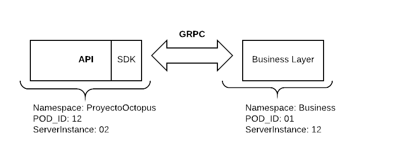

# Vert.x3 gRPC example

This project contains an example to show the use of gRPC services with Vert.x3.



## Setup a MongoDB

Although you can use your preferred database, this project is already setup to
work with a MongoDB database. You only need to start a server using the following
docker command:

```
docker run --rm -p 27017:27017 -d mongo
``` 

Docker run options used:

- `-d` Run the container in background and print the container ID.
- `--rm` Automatically remove the container when it exits.
- `-p` Publish a container's port(s) to the host.


## Running the example

To run the example first you have to build it with the following command:

```
mvn clean package
```

Then you must set the environment variable CONFIG_PATH to indicate where the config file 
is located. To do that run the following command in your root folder of the project:

```
export CONFIG_PATH=$PWD/src/main/resources/config.json
```

Once the build has finished, a "fat" .jar will be placed in each project's target
folder. You must run them like this:

```
java -jar service/target/service-1.0-SNAPSHOT-fat.jar
java -jar api/target/service-1.0-SNAPSHOT-fat.jar
```

Now the example should be up and running and you will be able to use the API with a 
client like Postman or cURL. Here there ara some examples with cURL:

Create person request:
```
curl --request POST \
  --url http://localhost:8000/person-api/v1/people \
  --header 'content-type: application/json' \
  --data '{
	"name": "Nice",
	"lastName": "Person",
	"email": "nice.person@bq.com",
	"age": 23
}'
```

Retrieve all people request:
```
curl --request GET \
  --url http://localhost:8000/person-api/v1/people
```

Retrieve single person request:
```
curl --request GET \
  --url http://localhost:8000/person-api/v1/people/<person-id>
```
